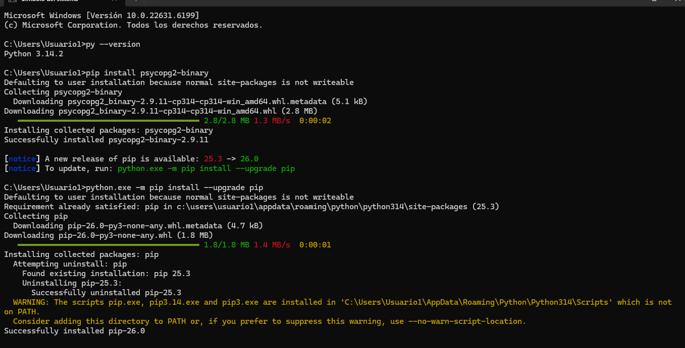
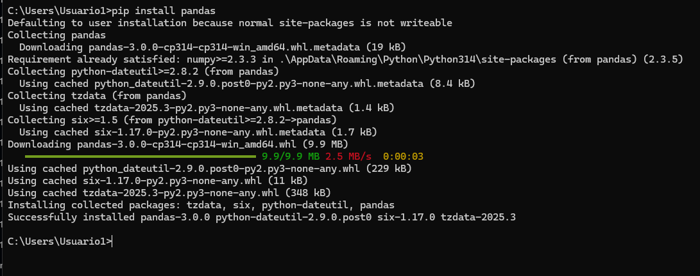
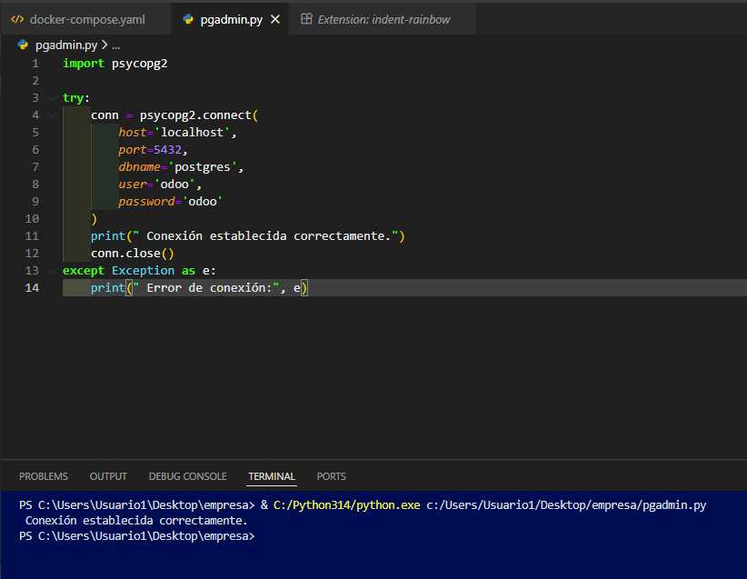
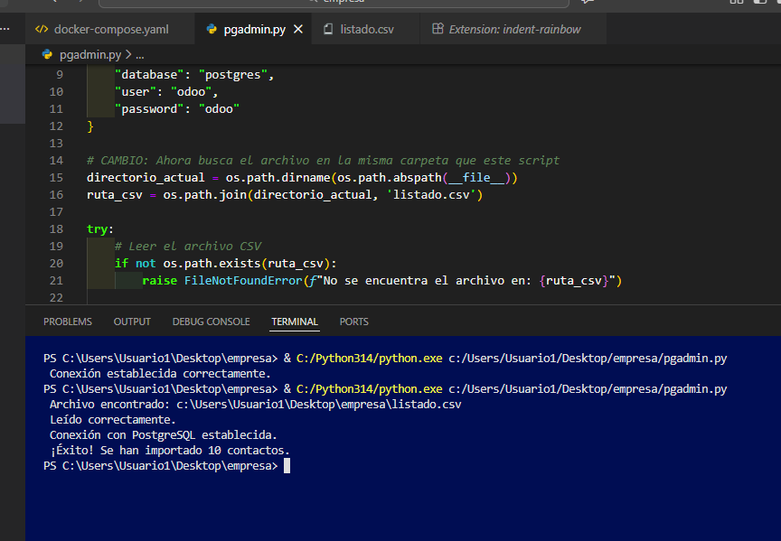
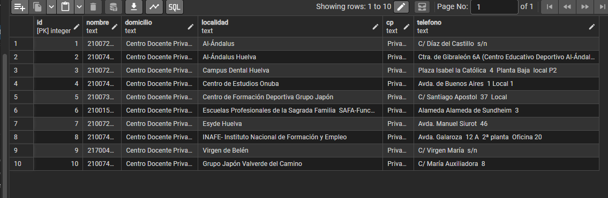

# Proyecto de Importación de Datos: CSV a PostgreSQL

Este proyecto documenta la configuración de un entorno de desarrollo utilizando **Docker**, la instalación de dependencias en **Python 3.14** y la ejecución de un script para importar contactos desde un archivo CSV a una base de datos PostgreSQL.

---

## 🚀 Pasos del Proyecto

### 1. Configuración del Entorno Python
Se verificó la versión de Python y se instalaron las librerías necesarias para la conexión con la base de datos y el manejo de datos. Se actualizó `pip` a la versión 26.0 para asegurar la compatibilidad.

* **Librerías:** `psycopg2-binary` y `pandas`.

---

### 2. Despliegue de Infraestructura con Docker
Se utilizó **Docker Compose** para levantar los servicios de la arquitectura:
* **PostgreSQL**: Motor de base de datos.
* **Odoo**: Sistema de gestión.
* **pgAdmin**: Administración gráfica de la BD (se observa en estado de reinicio en la captura, pero los servicios de datos quedaron operativos).

---

### 3. Validación de Conexión y Scripting
Se desarrolló un script de Python (`pgadmin.py`) para testear la comunicación con el contenedor de base de datos a través del puerto **5432**.

Posteriormente, se integró la lógica para leer el archivo `listado.csv` de forma dinámica y realizar la carga masiva de registros.

---

### 4. Resultado Final en la Base de Datos
Tras la ejecución, se validó mediante una consulta SQL que los 10 registros del CSV se insertaron correctamente con sus respectivos campos: `nombre`, `domicilio`, `localidad`, `cp` y `telefono`.

---

## 🛠️ Tecnologías Utilizadas
* **Python 3.14.2**
* **Docker & Docker Compose**
* **PostgreSQL**
* **Pandas** (Procesamiento de datos)
* **Psycopg2** (Adaptador de BD)
